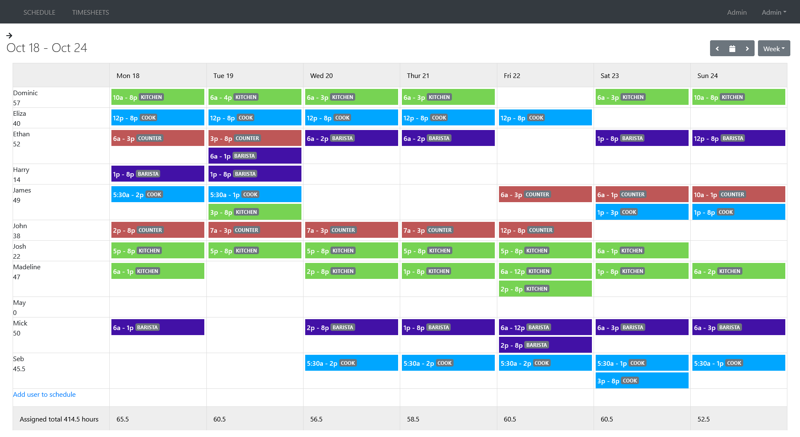
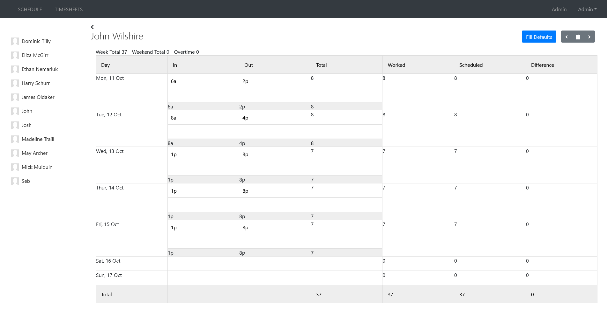
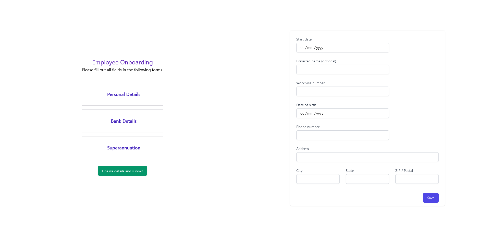

# Scheduler

Create and publish staff rosters instantly. Track worked hours with ease. Onboard employees in seconds.





<!--  -->

# Features

- Save shifts as templates, allowing instant adding in future.
- Filter schedule view by positions
- View schedule by week or day
- Display scheduled shifts for easy comparison to worked hours in timesheets app
- Employee onboarding webapp for easy collection of personal/banking/super information.

# Project Overview

This project was developed for a business with needs for a modern way to onboard employees (collecting personal/banking/super information), creating schedules, and tracking timesheets.

Also included is a brand identity website.

The solution consists of seven microservices powering three different SPA WebApps, and is deployed with Docker.


| Service | Language | Description |
| - | - | - |
| [proxy](./proxy) | NGINX | Reverse proxy. May replace with istio in future. |
| [db](./database) | PostgreSQL | PostgreSQL database. |
| [frontend](./frontend) | ReactJS VueJS NuxtJS | Three Single Page Applications, a brand identity website, roster scheduler/timesheet tracker WebApp, and employee onboarding WebApp. |
| [auth](./services/Auth) | C#/ASP.NET | Authentication microservice |
| [onboarding](./services/Onboarding) | Rust/Rocket | Employee onboarding microservice. |
| [positions](./services/Positions) | C#/ASP.NET | Positions microservice. |
| [scheduler](./services/Scheduler) | C#/ASP.NET | Scheduler microservice. |
| [templates](./services/Templates) | C#/ASP.NET | Schedule templates microservice. |
| [timesheets](./services/Timesheets) | C#/ASP.NET | Timesheets microservice. |
| [users](./services/Users) | C#/ASP.NET | Users microservice. |

# Configuration

Project is bound to a domain with each service using a separate subdomain. The default configured domain is DOMAIN.COM.

Please refer to CONFIG.md.

# Build

## Docker

Download and build the Scheduler project.

```
git clone https://github.com/sysexit/scheduler.git
cd scheduler/
docker-compose up -d
```

# Access

If using default .ENV options, the following HOSTS records must be added.

Windows: ``C:\Windows\System32\drivers\etc\hosts``

Linux: ``/etc/hosts``

```
127.0.0.1 domain.com
127.0.0.1 staff.domain.com
127.0.0.1 api.domain.com
127.0.0.1 hr.domain.com
```

# Websites

Replace ``domain.com`` with custom domain if one was configured.

Main/brand identity: ``http://domain.com``

Scheduler WebApp: ``http://staff.domain.com``

Employee Onboarding WebApp: ``http://hr.domain.com/onboarding/token``

# Demo database / login

Project comes with a demo database with example an exemplar schedule for the period October 18 - October 24.

## Logins

There are two access levels, Administrator, and staff. Administrator gives access to modifying schedules and all user timesheets. Staff are only allowed to view schedules, and modify their own timesheets.

| Email | Password | Access Level |
| - | - | - |
| admin@domain.com | password | Administrator |
| example1@mail.com | password | Staff |
| example2@mail.com | password | Staff |
| example3@mail.com | password | Staff |
| example4@mail.com | password | Staff |
| example5@mail.com | password | Staff |
| example6@mail.com | password | Staff |
| example7@mail.com | password | Staff |
| example8@mail.com | password | Staff |
| example9@mail.com | password | Staff |
| example10@mail.com | password | Staff |
| example11@mail.com | password | Staff |
